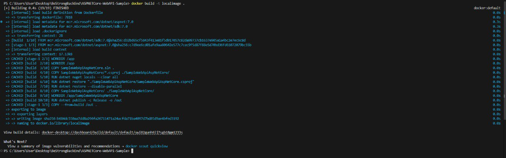
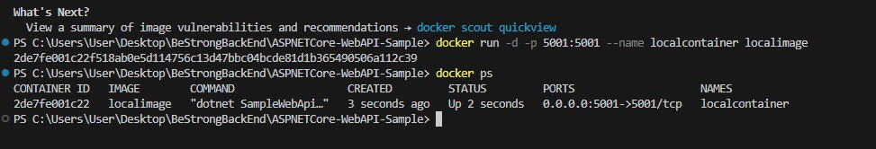
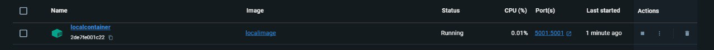
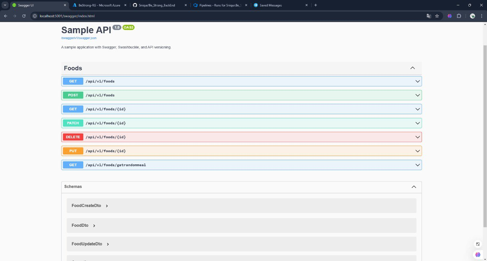
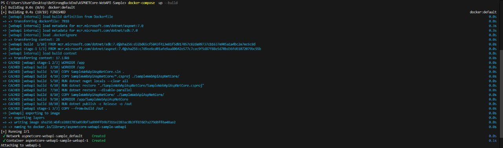
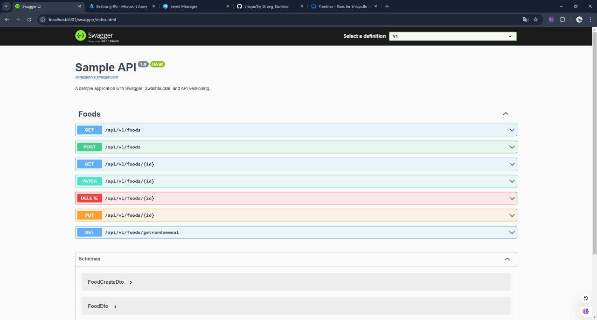
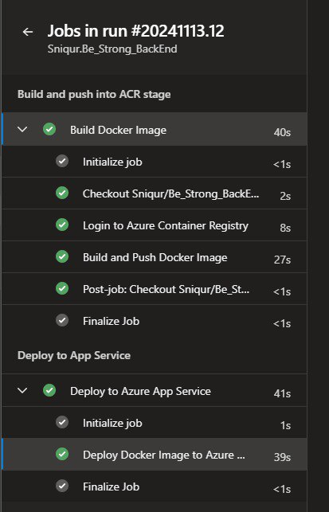
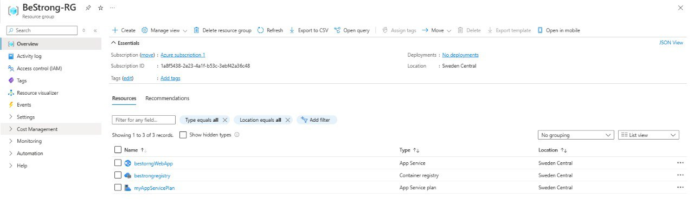
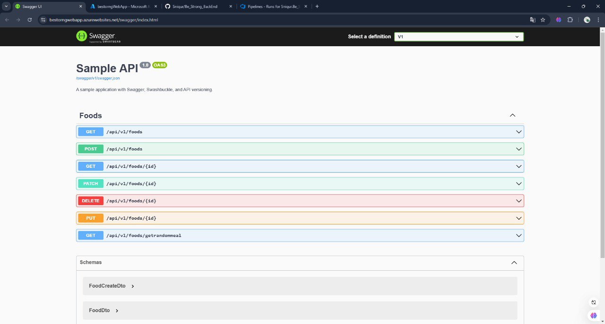

# Docker CI/CD Pipeline

## Stage 1: Local Testing

### Files Created:
1. **Dockerfile**

    I use `dotnet/sdk` image for  **Build Stage** 
    and `dotnet/aspnet` image for **Run Stage**

2. **docker-compose.yml**

## Testing containerized application locally

- **Building image**  
  

- **Run built image**  
  

- **Docker Desktop**  
  

- **Browsing localhost:5001/swagger**  
  

- **docker-compose Check**
   

- **Browsing localhost:5001/swagger (docker-compose)**  

   

## Stage 2: Deploying

## Azure CI/CD Pipeline

**Pipeline file**:  `azure-pipelines.yml`. 

The pipeline is divided into two stages:

1. **Build_Push**
2. **Deploy**

Results after executing the code

## Result of ci/cd pipline.

- **Successfull run.**
   

- **Deployed Infrastructure**
   

- **Deployed application in App service**
  
  